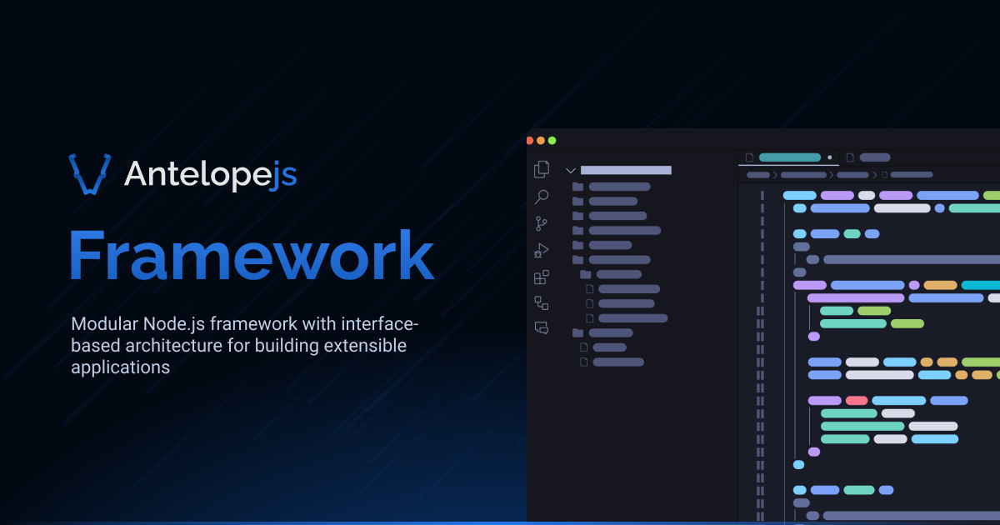

<div align="center">
  <a href="https://antelopejs.com">
    <picture>
      
    </picture>
  </a>
  <h1>AntelopeJS</h1>

<a href="https://www.npmjs.com/package/@antelopejs/core"></a>
<a href="./LICENSE"></a>
<a href="https://discord.gg/sjK28QHrA7"></a>
<a href="https://antelopejs.com"></a>

</div>

## Hexagonal architecture. Beyond your own code.

AntelopeJS is a TypeScript framework and CLI for Node.js applications. It extends the ports-and-adapters model across your application and the ecosystem modules you install: consumers depend on explicit contracts, provider modules implement them, and your application selects the implementations.

You already separate business behavior from integrations. AntelopeJS supplies the interface binding, module lifecycle and assembly mechanisms, so you do not have to rebuild that infrastructure for each project.

## One contract model, across the ecosystem

The dependency boundary stays the same whether you write the provider or install it:

```text
Business module ──depends on──▶ Contract ◀──implements── Provider module
```

- **Contracts describe capabilities.** Interface packages expose the public API that consumers and implementations agree on.
- **Providers own integrations.** A provider module registers its implementation with the runtime. Consumers call the contract instead of importing that provider.
- **The application owns the choice.** Configure local, package or Git module sources in `antelope.config.ts`, outside consuming business modules.
- **The runtime handles the connections.** AntelopeJS manages interface bindings and module lifecycle through the same mechanisms for local and ecosystem modules.

For example, the [MongoDB](https://github.com/AntelopeJS/mongodb) and [RethinkDB](https://github.com/AntelopeJS/rethinkdb) modules both declare the shared [database contract](https://github.com/AntelopeJS/interface-database). They also expose provider-specific interfaces: using those deliberately ties that consumer to the provider.

## Change implementations, with explicit limits

A replacement can leave consuming code unchanged when it supports the required contract version, capabilities and behavior. Provider configuration, credentials, data migrations and operational differences still need attention. Matching types alone does not establish compatibility.

AntelopeJS provides the mechanisms for these boundaries; it does not prevent your code from bypassing them. Consumers still depend on their contracts, and the framework does not automatically make your business code framework-independent.

Development hot module reloading is a separate workflow feature, not a promise of live production migration between providers.

## Installation

Install `@antelopejs/core`, which provides the `ajs` CLI:

```bash
pnpm add -g @antelopejs/core
```

## Getting Started

To create a new project with the CLI:

```bash
ajs project init <project-name>
```

## Plugins

Official plugins ship as separate global packages that add command groups to the `ajs` CLI. They are versioned and updated independently of the core.

| Plugin | Package                    | Description           |
| ------ | -------------------------- | --------------------- |
| `dms`  | `@antelopejs/dms-frontend` | DMS frontend commands |

Run a plugin command through the CLI:

```bash
ajs dms <command>
```

If the plugin is not installed, the CLI offers to install it globally with the same package manager that installed `@antelopejs/core`. You can also install it yourself:

```bash
pnpm add -g @antelopejs/dms-frontend
```

Each plugin also installs its own executable, so package scripts can call it directly:

```bash
ajs-dms <command>
```

Arguments, exit codes and termination signals pass through unchanged in both forms.

List the official plugins and see which ones are installed:

```bash
ajs plugins
```

Keep the CLI and its plugins up to date:

```bash
ajs update        # core plus every installed official plugin
ajs update dms    # a single plugin
```

`ajs update` reuses the package manager that installed the CLI globally: npm, pnpm, or Yarn Classic (Yarn 1, `yarn global add`). It updates one package at a time and stops at the first failure. When the CLI is not installed globally (a project dependency or a source checkout), it refuses to touch a global installation and asks you to update `@antelopejs/core` in the project instead.

Plugins declare the core versions they support through `peerDependencies` on `@antelopejs/core`. When the installed plugin does not support the running CLI, the command stops with an error naming both versions instead of delegating.

## Documentation

- [Introduction](https://antelopejs.com/docs/get-started/introduction) — Why the same boundaries matter across your application and its dependencies
- [Quick Start](https://antelopejs.com/docs/get-started/quick-start) — Create your first project
- [Architecture](https://antelopejs.com/docs/get-started/architecture) — Contracts, implementations and application assembly
- [Interfaces](https://antelopejs.com/docs/concepts/interfaces) — Define and implement a capability
- [Module configuration](https://antelopejs.com/docs/concepts/configuration) — Select module sources and configure implementations
- [Explore the ecosystem](https://antelopejs.com/modules) — Find modules for your application

## License

This project is licensed under the Apache License 2.0 - see the [LICENSE](LICENSE) file for details.
