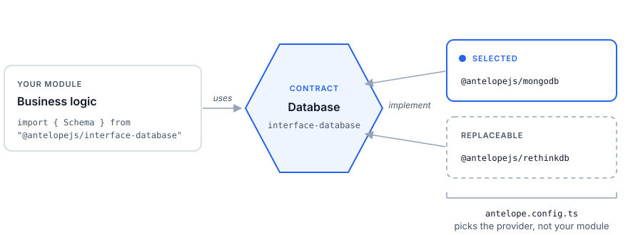

<div align="center">
  
  <h1>AntelopeJS</h1>
  <p><strong>Hexagonal architecture, beyond your own code.</strong></p>

<a href="https://www.npmjs.com/package/@antelopejs/core"></a>
<a href="./LICENSE"></a>
<a href="https://discord.gg/g4pFt6eXqu"></a>
<a href="https://framework.antelopejs.com/docs/get-started/introduction"></a>

[Docs](https://framework.antelopejs.com/docs/get-started/introduction) · [Quick start](#quick-start) · [Discord](https://discord.gg/g4pFt6eXqu)

If AntelopeJS saves you work, a ⭐ helps other developers find it.

</div>


**The AntelopeJS framework (3:41).** Contracts, providers you can swap, your own modules and one CLI.

https://github.com/user-attachments/assets/c632616c-e48d-4c7e-9306-22ad0f4a6351

AntelopeJS is a TypeScript framework and CLI for Node.js applications. It extends the ports-and-adapters model from your own code to the modules you install: business modules depend on contracts, provider modules implement them, and the application picks which provider runs. The open-source back office [AntelopeJS DMS](https://github.com/AntelopeJS/dms) is built on it.

## Why AntelopeJS

<p align="center">
  
</p>

- **Contracts, not imports.** A module imports interface packages such as [`@antelopejs/interface-database`](https://github.com/AntelopeJS/interface-database), never another module's files.
- **Providers you can swap.** [`@antelopejs/postgres`](https://github.com/AntelopeJS/postgres), [`@antelopejs/mongodb`](https://github.com/AntelopeJS/mongodb) and [`@antelopejs/rethinkdb`](https://github.com/AntelopeJS/rethinkdb) implement the same database contract; `antelope.config.ts` chooses one, from npm, Git or a local folder.
- **A runtime that wires them.** The core binds every interface to its provider, queues calls until the provider is ready, and runs each module's `construct`, `start`, `stop` and `destroy` steps.
- **Hot reload in development.** `ajs project dev --watch` reloads a changed module without restarting the others.
- **One CLI.** `ajs` creates projects and modules, adds providers, runs tests, and builds and starts the application. It can also run embedded in a host application through `createRuntime`.

A replacement provider leaves consuming code unchanged only when it supports the contract version and behavior that code relies on. Configuration, credentials and data migrations still need your attention.

## Install

AntelopeJS requires Node.js 20.19 or later. There is nothing to install first: the quick start below runs the CLI with `npx`. To get the `ajs` command on your `PATH`, install the CLI globally:

```bash
pnpm add -g @antelopejs/core
```

## Quick start

Create a project with a first module, then run it in development mode. Inside a project that lists `@antelopejs/core` as a dependency, npx runs that installed copy:

```bash
npx @antelopejs/core project init my-app --template blank-typescript --pm pnpm --no-git-init
cd my-app
npx @antelopejs/core project dev --watch
```

Leave out the flags to choose a template interactively. Templates are named by slug, for example `blank-typescript` and `dms-demo`.

Add a provider for an interface your module uses, or let the CLI find one for every unresolved interface:

```bash
npx @antelopejs/core project modules add @antelopejs/mongodb
npx @antelopejs/core project modules install
```

## Plugins

Official plugins add command groups to `ajs` and ship as separate global packages:

| Command   | Package                                                                  | Purpose                                    |
| --------- | ------------------------------------------------------------------------ | ------------------------------------------ |
| `ajs dms` | [`@antelopejs/dms-frontend`](https://github.com/AntelopeJS/dms-frontend) | Develop, build and deploy the DMS frontend |

When a plugin is missing, `ajs` offers to install it with the package manager that installed the CLI. `ajs plugins` lists the official plugins and `ajs update` updates the CLI with every installed plugin.

## Agent skills

`@antelopejs/core` ships the framework's agent skills in `skills/`, declared under `antelopeJs.skills`: `antelopejs` (the mental model and router), `ajs-cli`, `ajs-consume-interface` and `ajs-author-interface`. They follow the core version a project installs. The [AntelopeJS agent skills](https://github.com/AntelopeJS/agent-skills) sync links them, like every package-shipped skill, into a project's `.claude/skills/` and `.agents/skills/`, and the DMS assistant (`@antelopejs/dms-ai`) loads them on its own.

## Documentation

- [Introduction](https://framework.antelopejs.com/docs/get-started/introduction): why the same boundaries matter across your application and its dependencies
- [Quick start](https://framework.antelopejs.com/docs/get-started/quick-start): create and run your first project
- [Architecture](https://framework.antelopejs.com/docs/get-started/architecture): contracts, implementations and application assembly
- [Interfaces](https://framework.antelopejs.com/docs/concepts/interfaces) and [modules](https://framework.antelopejs.com/docs/concepts/modules): define and implement a capability
- [Configuration](https://framework.antelopejs.com/docs/concepts/configuration): select module sources and configure providers
- [CLI cheat sheet](https://framework.antelopejs.com/docs/cli/cheat-sheet): every `ajs` command
- [Interface catalog](https://interfaces.antelopejs.com): the official contracts and their implementations

## Compatibility

| Requirement                                                                  | Version          |
| ---------------------------------------------------------------------------- | ---------------- |
| Node.js                                                                      | `>=20.19`        |
| [`@antelopejs/interface-core`](https://github.com/AntelopeJS/interface-core) | `>=0.3.0 <0.4.0` |

## Contributing

Read [CONTRIBUTING.md](./CONTRIBUTING.md) before you open a pull request. The local checks are:

```bash
pnpm install
pnpm lint
pnpm test
```

## License

[Apache-2.0](./LICENSE)
